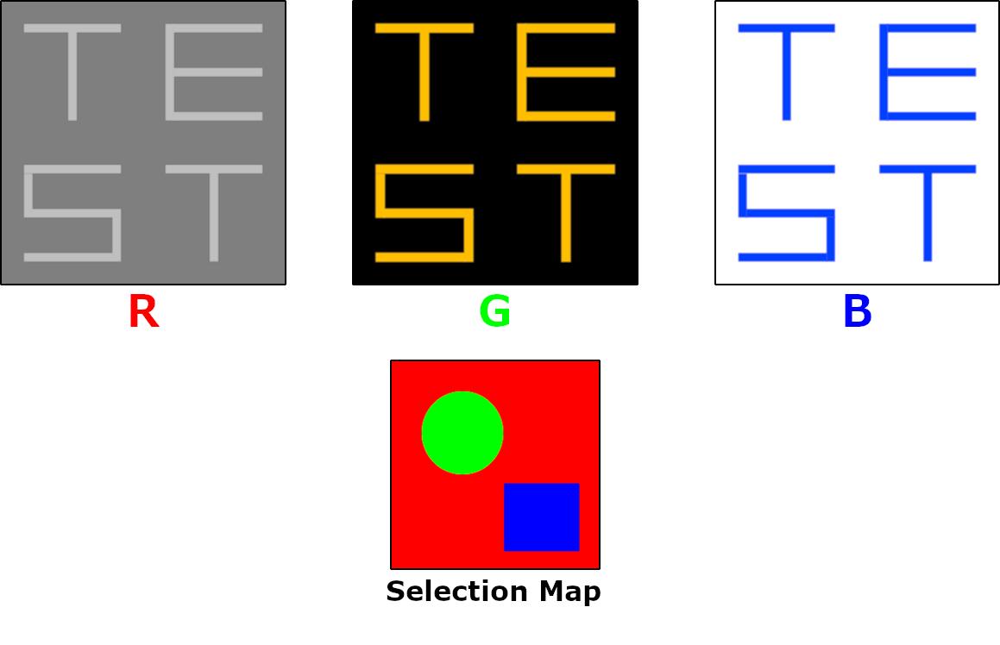
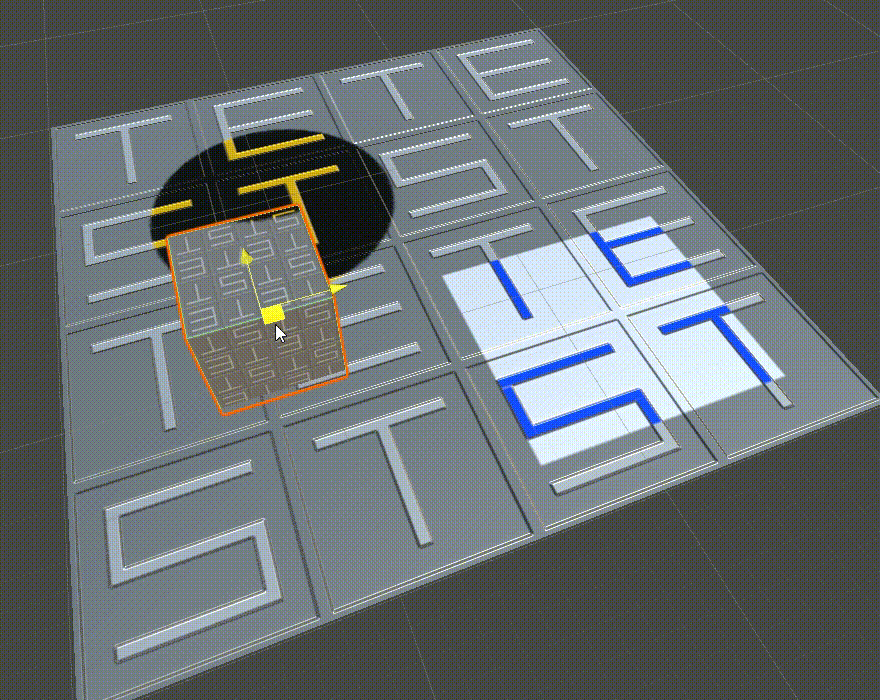
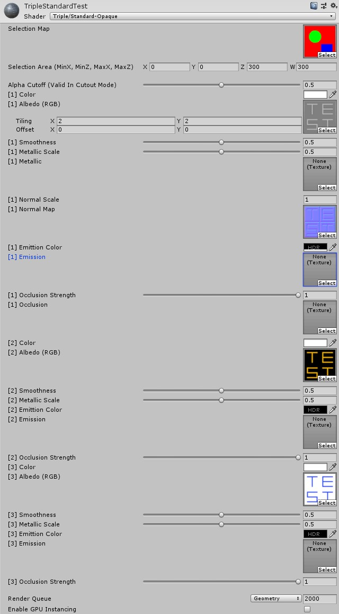

# unity-triple-blend-shader

Shaders which blends three textures by selection map texture for Unity.

This shader uses three source textures and a selection map texture as below.

By using these sources, the shader blends three textutures according to world space cordinations.

## Test Environment

- Unity2019.3.15f1
- Windows10

## Usage

### Shader

Select a shader you want to use from below options.
Each shader coresponts to `Rendering Mode` of standard shader built in Unity.

- TripleBlend/Standard-Opaque
- TripleBlend/Standard-Cutout
- TripleBlend/Standard-Fade
- TripleBlend/Standard-Transparent

Then, set each properties as below.

### TripleBlendStandardShaderSelectionMapSetter

TripleBlendStandardShaderSelectionMapSetter is a script to set a selection map texture to materials which use TripleBlendShader.

1. Atatch TripleBlendStandardShaderSelectionMapSetter to game objects or these parents which has materials using TripleBlendShader
1. Call `TripleBlendStandardShaderSelectionMapSetter.SetSelectionMapTextureAndAreaToAll` method from your scripts

As a result, set selection map texture is set to all materials using TripleBlendShader.

## LICENSE

The codes in this repository are lisenced unfer the [MIT License](https://github.com/CdecPGL/unity-triple-blend-shader/blob/master/LICENSE).
